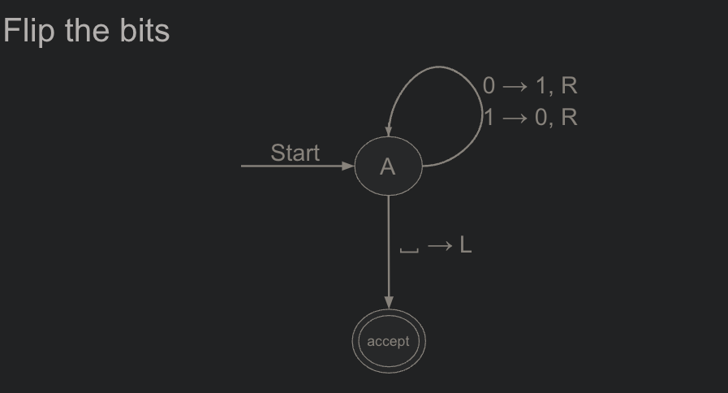
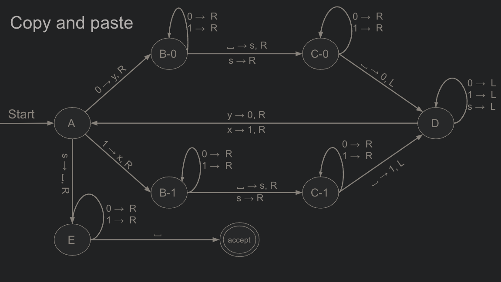

# Turing Machines

[](https://upload.wikimedia.org/wikipedia/commons/b/bb/Turing_machine_1.JPG)

_Note._ From _Turing Machine 1_ [Drawing], by W.V. Bailey, 2006, Wikimedia Commons
[(https://en.wikipedia.org/wiki/File:Turing_machine_1.JPG)](https://en.wikipedia.org/wiki/File:Turing_machine_1.JPG). CC BY-SA 3.0 DEED

## Table of Contents

- [Turing Machines](#turing-machines)
  - [Table of Contents](#table-of-contents)
  - [Description](#description)
  - [Installation](#installation)
  - [Usage](#usage)
    - [As a Library](#as-a-library)
    - [From the Command Line](#from-the-command-line)
      - [Commands](#commands)
      - [Flags](#flags)
      - [Graph](#graph)
      - [Example](#example)
      - [Creating Transitions](#creating-transitions)
      - [Included Machines](#included-machines)
        - [Flip the Bits](#flip-the-bits)
        - [Copy and Paste](#copy-and-paste)
  - [Tests](#tests)
  - [Tech Stack](#tech-stack)
  - [Contact](#contact)
  - [LICENSE](#license)

## Description

This repo serves as a dependency-free library and command line utility for creating and running [Turing Machines](https://en.wikipedia.org/wiki/Turing_machine). Currently only single tape machines are supported.

A Turing Machine is an expansion upon [finite automata](https://en.wikipedia.org/wiki/Finite-state_machine) and consists of two primary components:

1. A `Tape` - A sequence of cells that extend to infinity in one or both directions
   1. Each cell contains a `symbol` from a finite alphabet, **`Γ`**, and is read from or written to using a `tape head`.
2. A `Control Unit` - Contains a finite set of instructions which are executed.
   1. Each instruction causes the tape head to:
      1. _Read_ a symbol from the current cell.
      2. _Write_ a symbol to the current cell.
      3. _Move_ the tape head
         1. To an adjacent cell
         2. Or leave in current position

Each instruction in the `control unit` contains five parts:

1. Current Machine State
2. Tape symbol read from the current cell
3. Tape symbol to write in the current cell
4. Direction to move the tape head
5. Next machine state

Which can be expressed as a tuple: _`(currentState, symbolRead, symbolToWrite, move, nextState)`_

Turing Machines can be deterministic or non-deterministic. If the machine has at least two states with the same state and input, then it is non-deterministic.

**_Assumptions_**

1. The input string is placed on the tape by placing each letter into a series of connected cells. All other cells that do not contain the input are blank cells, typically denoted using **`Λ`**.
2. The tape head always starts at the leftmost cell unless a different starting position is specified.
3. There is only one starting state.
4. There is only one accept state typically noted by `Halt`.

An input is _`accepted`_ by the machine if the machine enters the `Halt` state. Otherwise, the string is _`rejected`_. The language of any turning machine _`L(A)`_, is the set of input strings accepted by the machine.

**References**:

Hein, J. L. (2017). [_Discrete structures, logic, and computability_](https://www.jblearning.com/catalog/productdetails/9781284070408) (4th ed.). Jones & Bartlett Publishers. pp. 833-835

## Installation

Turing Machines does not rely on external dependencies and can be used by cloning the repository.

Clone the repo:

```bash
git clone git@github.com:iiTONELOC/turing-machines.git
```

## Usage

Turing Machines can be used as a library or from the command line.

### As a Library

```ts
// import the single tape turing machine
import {singleTapeTM} from '<pathToFolder>/turing-machines/index.js';

// destructure the machine, its runner, the printHistory function, and
// the pre-included machineGraphs
const {machine, runner, printHistory, machineGraphs} = singleTapeTM;

// create a new machine
const tm = machine({
  input: '11011',
  transitions: machineGraphs.flipTheBits.transitions,
  startingState: machineGraphs.flipTheBits.startState
});

// run the machine
const executedMachine = runner(tm);

// get the result as a string
const result = executedMachine.tape.join('');

console.log(result); // 00100

// verbose output that shows each instruction executed, the tape and the tape head
printHistory(result);
```

### From the Command Line

Currently only the pre-included machines for copy and pasting binary strings or flipping their bits can be used from the command line.

#### Commands

```bash
#from the project root
npm run start <input> <graph>  [--] [--flags]
```

```bash
#from anywhere
node <path to project folder/index.js> <input> <graph> [--flags]
```

#### Flags

```bash
# to see verbose output
--history
```

#### Graph

```bash
#flip the bits
flipTheBits

#copy and paste
copyAndPaste
```

#### Example

```bash
node TuringMachine/index.js 1101 flipTheBits
Input : 1101
Result: 0010
Steps : 5
```

```bash
node TuringMachine/index.js 1101 flipTheBits --history
Input : 1101
Result: 0010
Steps : 5

History:

State Step 1:
  State: q0
	Tape     : 1101
	Tape Head: ↑

	Input Symbol: 1
	Write Symbol: 0
	Move Tape Head: R
	Next State: q0

State Step 2:
  State: q0
	Tape     : 0101
	Tape Head:  ↑

	Input Symbol: 1
	Write Symbol: 0
	Move Tape Head: R
	Next State: q0

State Step 3:
  State: q0
	Tape     : 0001
	Tape Head:   ↑

	Input Symbol: 0
	Write Symbol: 1
	Move Tape Head: R
	Next State: q0

State Step 4:
  State: q0
	Tape     : 0011
	Tape Head:    ↑

	Input Symbol: 1
	Write Symbol: 0
	Move Tape Head: R
	Next State: q0

State Step 5:
  State: q0
	Tape     : 0010
	Tape Head:     ↑

	Input Symbol:
	Write Symbol:
	Move Tape Head: L
	Next State: accept
```

#### Creating Transitions

The machine's `transitions` property when creating a new machine expects an object matching the following definition:

```ts
interface StateTransitions {
  [machineState: string]: {
    [tapeSymbol: string]: {
      write: string;
      move: 'L' | 'R' | null;
      nextState: string;
    };
  };
}
```

The `machineState` keys are strings that correspond to the available machine states.

The value is a nested object where the `tapeSymbol` keys represents what to do with the current tape symbol. If an input is not explicitly listed, the machine moves to the `reject` state automatically.

#### Included Machines

##### Flip the Bits

For example, the included machine to flip the bits can be expressed graphically as:



The corresponding `StateTransitions`:

```ts
/**
 * Flips the bits in a binary string
 *
 * Σ = {0, 1}
 * Γ = {0, 1, Λ}
 * L(A) = (0, 1)*
 */
const flipTheBits = {
  A: {
    0: {write: '1', move: 'R', nextState: 'A'},
    1: {write: '0', move: 'R', nextState: 'A'},
    ' ': {write: ' ', move: 'L', nextState: 'accept'}
  },
  accept: {}
};
```

##### Copy and Paste

To copy and paste, the graph and transitions are a bit more complicated



And the corresponding transitions:

```ts
/**
 * Σ = {0, 1}
 * Γ = {0, 1, Λ, x, y, s}
 * L(A) = (0, 1)+
 */
export const copyAndPaste = {
  A: {
    0: {write: 'y', move: 'R', nextState: 'B-0'},
    1: {write: 'x', move: 'R', nextState: 'B-1'},
    s: {write: ' ', move: 'R', nextState: 'E'}
  },
  'B-0': {
    ' ': {write: 's', move: 'R', nextState: 'C-0'},
    s: {write: null, move: 'R', nextState: 'C-0'},
    0: {write: null, move: 'R', nextState: 'B-0'},
    1: {write: null, move: 'R', nextState: 'B-0'}
  },
  'C-0': {
    ' ': {write: '0', move: 'L', nextState: 'D'},
    0: {write: null, move: 'R', nextState: 'C-0'},
    1: {write: null, move: 'R', nextState: 'C-0'},
    s: {write: null, move: 'R', nextState: 'C-0'}
  },
  D: {
    x: {write: '1', move: 'R', nextState: 'A'},
    y: {write: '0', move: 'R', nextState: 'A'},
    0: {write: null, move: 'L', nextState: 'D'},
    1: {write: null, move: 'L', nextState: 'D'},
    s: {write: null, move: 'L', nextState: 'D'}
  },
  'B-1': {
    ' ': {write: 's', move: 'R', nextState: 'C-1'},
    s: {write: null, move: 'R', nextState: 'C-1'},
    0: {write: null, move: 'R', nextState: 'B-1'},
    1: {write: null, move: 'R', nextState: 'B-1'}
  },
  'C-1': {
    ' ': {write: '1', move: 'L', nextState: 'D'},
    0: {write: null, move: 'R', nextState: 'C-1'},
    1: {write: null, move: 'R', nextState: 'C-1'}
  },
  E: {
    ' ': {write: null, move: null, nextState: 'accept'},
    0: {write: null, move: 'R', nextState: 'E'},
    1: {write: null, move: 'R', nextState: 'E'}
  },
  accept: {}
};
```

## Tests

Turing machines was implemented using TDD practices. Tests can be verified by running npm run test.

```bash
npm run test

> turing-machines@1.0.0 test
> node --test

▶ Single Tape Turing Machine
  ✔ should be a function (0.329625ms)
  ✔ should return an object (0.129084ms)
  ✔ should have a "tape" property (0.041625ms)
  ✔ should have an empty "tape" array (0.230833ms)
  ✔ should have a "tape" property that can be set to a different value (0.077791ms)
  ✔ should have a "tape" property that adjusts itself based on the input (0.040625ms)
  ✔ should have a "state" property (0.096584ms)
  ✔ should have a "state" property with an initial value of "q0" (0.147583ms)
  ✔ should have a "startState" property with an initial value of "q0" (0.046625ms)
  ✔ should have a "startState" property that can be set to a different value (0.245166ms)
  ✔ should have a "tapeHead" property (0.0515ms)
  ✔ should have a "tapeHead" property with an initial value of 0 (0.030958ms)
  ✔ should have a "tapeHead" property that can be set to a different value (0.035541ms)
  ✔ should have a "stateTransitions" property (0.025292ms)
  ✔ should have a stateTransitions property that accepts a StateTransition object (0.023167ms)
  ✔ should have a stateTransitions property that accepts a StateTransition object (0.036ms)
  ✔ should have an "input" property (0.023333ms)
  ✔ should have an "input" property with an initial value of an empty string (0.0225ms)
  ✔ should have an "input" property that can be set to a different value (0.032208ms)
  ✔ should have an "input" property that correctly places the input at the end of a tape (0.086834ms)
  ✔ should have a "history" property (0.02275ms)
  ✔ should have a "history" property with a "stateHistory" property (0.02175ms)
  ✔ should have a "history" property with a "tapeHistory" property (0.021208ms)
  ✔ should have a "history" property with a "tapeHeadHistory" property (0.020583ms)
  ✔ should have a "history" property with a "stateHistory" array that contains the initial state (0.021708ms)
  ✔ should have a "history" property with an empty "tapeHistory" array (0.021083ms)
  ✔ should have a "history" property with an empty "tapeHeadHistory" array (0.021417ms)
▶ Single Tape Turing Machine (4.060583ms)

▶ Copy and Paste
  ✔ should run the Turing Machine until it reaches a final state (0.567167ms)
  ✔ should run the Turing Machine until it reaches a reject state (0.064292ms)
▶ Copy and Paste (1.514417ms)

▶ Flip the Bits
  ✔ should run the Turing Machine until it reaches a final state (0.411041ms)
  ✔ should run the Turing Machine until it reaches a reject state (0.099625ms)
▶ Flip the Bits (1.297292ms)

▶ get transition
  ✔ should return the transition object for the current state and input symbol (0.352958ms)
  ✔ should return undefined if no transition is found (0.101792ms)
▶ get transition (1.320375ms)

▶ move tape head
  ✔ should move the tape head to the right (0.068708ms)
  ✔ should move the tape head to the left (0.045375ms)
▶ move tape head (0.196334ms)

▶ write symbol
  ✔ should write the symbol to the tape (0.077875ms)
  ✔ should not write the symbol to the tape if the write property is null or undefined (0.154333ms)
▶ write symbol (0.381417ms)

▶ get current symbol
  ✔ should return the current symbol from the tape (0.153417ms)
  ✔ should return a blank space if the tape head is out of bounds (0.040708ms)
▶ get current symbol (0.30975ms)

▶ update state
  ✔ should update the state of the Turing Machine (0.11375ms)
  ✔ should set the state to "reject" if no transition is provided (0.142125ms)
  ✔ should set the state to "reject" if the transition object does not have a next state (0.049167ms)
  ✔ should set the state to "reject" if the requested transition does not exist (0.03475ms)
▶ update state (0.504875ms)

▶ run single tape TM
  ✔ should run the Turing Machine until it reaches a final state (0.123583ms)
  ✔ should run the Turing Machine until it reaches a reject state (0.117084ms)
▶ run single tape TM (0.32525ms)

▶ getInput
  ✔ should be a function (0.140167ms)
  ✔ should return a string (2.191167ms)
  ✔ should return the correct string (1.3565ms)
  ✔ Should stringify the input (1.729834ms)
▶ getInput (6.5075ms)

ℹ tests 49
ℹ suites 10
ℹ pass 49
ℹ fail 0
ℹ cancelled 0
ℹ skipped 0
ℹ todo 0
ℹ duration_ms 61.659875
```

## Tech Stack

| Technology             | Description                          | Links                                                                                                                          |
| ---------------------- | ------------------------------------ | ------------------------------------------------------------------------------------------------------------------------------ |
| Node                   | JavaScript runtime environment       | [Node.js](https://nodejs.org/en/about)                                                                                         |
| ECMAScript®/JavaScript | General purpose programming language | [EMCAScript®](https://262.ecma-international.org/14.0/), [JavaScript](https://developer.mozilla.org/en-US/docs/Web/JavaScript) |

## Contact

If you have any questions or would like to get in touch feel free to email me @ [anthonytropeano@protonmail.com](mailto:anthonytropeano@protonmail.com)

## LICENSE

This project is licensed by the MIT license. A copy can be viewed here: [LICENSE](./License)
